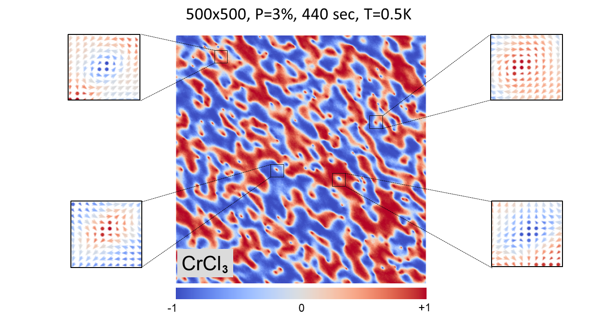

[](https://zenodo.org/doi/10.5281/zenodo.10472803)

A pyCUDA based Metropolis Monte Carlo simulator for 2D-magnetism systems. This code uses NVIDIA CUDA architecture wrapped by a simple python wrapper to work.

To use, clone the repository using

```

git clone https://github.com/arkavo/CUDA-METRO.git

```

into a directory of choice. Creating a new python3 environment is recommended to run the code.

To setup the environment after creation, simply run 
				```pip install -r requirements.pip```

Some template codes have already been provided under folder ```/src``` along with sample input files in ```/inputs``` and running configurations in ```/configs```

There are 4 seperate files to design your simulations. To run a simple simulation, use ```python main.py <input_file_name>```. 
# Summary
This code is a tool for efficient parallelization and running of the 2D classical Heisenberg model on newer hardware like GPUs. Efficient parallelization of Metropolis Monte Carlo simulation is challenging since the evolving states are typically not independent because of the Markov property. Here we focus on simulating magnetic phase transition under the anisotropic Heisenberg Model in a very high dimensional space, which is important for emerging two-dimensional (2D) magnetism and nontrivial topological spin textures. Previous attempts for parallelization are restricted to the simpler Ising Model and not applicable to 2D materials because of their finite magneto-crystalline anisotropy, complex crystal structures and long-range interactions.

# Working principle of Metropolis Monte Carlo
Given 2 states$\Omega_{1},\Omega_{2}$, and their energies $E_{1},E_{2}$ respectively, statistical mechanics and thermodynamics tells us that the relative probability between them existing at a time is 

$$\frac{p(E_2)}{p(E_1)}=\frac{e^{-\beta E_2}}{e^{-\beta E_1}}$$

where where $\beta=(k_bT)^{-1}$, $k_b$ being the Boltzmann constant and $T$ being the temperature. The energy of the Heisenberg model is calculated as

$$H=-\sum Js_i\cdot s_j - \sum K_x s_i \cdot s_j-\sum K_y s_i \cdot s_j-\sum K_z s_i \cdot s_j-\sum A s_i \cdot s_i-\mu B \cdot \sum s_i$$

Using these, we run the simulation towards an energy minima and then visualize the spin vectors.

# Results

The resulting code `CUDA-METRO` has returned satisfactory results in most of its test scenarios. It has been used to verify the Curie Temperature of a n umber of materials. Most notably, it has been used to verify spintronic microstructures in 2D materials like skyrmions and merons. Some of the most notable ones are shown below 
Fig1. Merons forming in $CrCl_3$ at $T=0.5K$, a grid size of $500\times 500$, and a total kernel size of $8192$(~3% of $500\times 500$). This simulation took $440s$.


Fig2. Left: Antiferromagnetic skyrmions in $MnBr_{2}$, Right: Ferromagnetic skyrmions in $CrInSe_3$. These simulations used a grid size of $200\times 200$, using a kernel size of $8192$(~20% of $200\times 200$). These simulations took a $700s$.

# Method
This is an *approximate* algorithm which mimics the classic single spin Metropolis Monte Carlo algorithm. This algorithm, however maximizes speed at the cost of minor accuracy. While in the single spin method, only 1 lattice point is evaluated at any given step, we take it further and evaluate multiple points at the same time. This works well for some time until we start evaluating too many points at the same time. It is advised to limit the parallelization to $~10\%$ of the total number, using more parallelization distorts the accuracy of further results. A benchmark for this has been recorded where we try to simulate the Curie temperature of $CrI_3$, with the results given below.
Fig3. The distortion of results with an increase in the number of points evaluated in parallel. Note how $<10\%$, the simulation closely follows the experimental reference results.

The above experiment shows a raw theoretical increase of $N\times$ amount increase in performance, while compromising slightly on the results. This makes this code most suited for large supercells which saturate the CUDA cores of any given GPU, even considering the high throughput of each Metropolis step.

# Tools
If one does not wish to use this purely for observation of microstructures in material, they can alternatively make use of its other modes like
## 1. Vector analysis/visualization

To run a vector analysis, simple execute ```python test_main.py <config file name>``` (main config file is ```/configs/test_config.json```)

After execution, an output folder will be created with name ```<prefix>_<material>_<date>_<time>``` with ```.npy``` files in them containing spin data in 1D array form as [s<sub>1</sub><sup>x</sup> s<sub>1</sub><sup>y</sup> s<sub>1</sub><sup>z</sup> s<sub>2</sub><sup>x</sup> s<sub>2</sub><sup>y</sup>.........s<sub>n</sub><sup>y</sup> s<sub>n</sub><sup>z</sup>] and an additional ```metadata.json``` file containing the details of the run.

For casual viewing, it is advised to use the in-built viewer as ```python test_view.py <folder name>``` to provide visuals of the spin magnitudes in 3 directions as well as a top-down vector map of the spins.

## 2. Curie temperature analysis

To run a Curie temperature analysis, execute ```python tc_sims.py``` after configuring the appropriate config file in ```/configs/tc_config.json```.

  

After the run, a graph of temperature vs magnetization and temperature vs susceptibility will be auto generated. If the graph is not desired, please comment out everything from line 21.