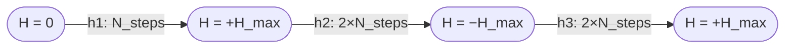
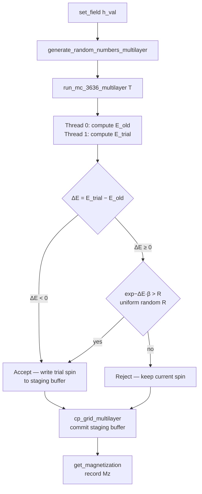
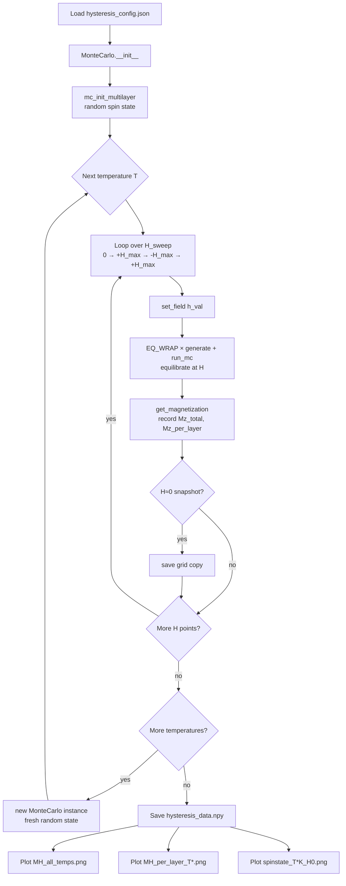

# Multilayer Implementation and Hysteresis Experiment

This document describes the extensions added to CUDA-METRO to support multilayer magnetic simulations and M–H hysteresis measurements, specifically targeting CrPS4-ML (a multilayer chromium thiophosphate system). It is written for someone already familiar with the single-layer CUDA-METRO workflow.

---

## 1. What Was Added

| File | Status | Purpose |
|---|---|---|
| `src/cudametro/montecarlo.py` | Modified | New CUDA kernels for multilayer MC; spatially varying field |
| `src/cudametro/construct.py` | Modified | Python API for multilayer init, run, field control |
| `src/cudametro/multilayer.py` | New | Standalone equilibration run script with field zones |
| `src/cudametro/multilayer_config.json` | New | Config for equilibration |
| `src/cudametro/hysteresis.py` | New | Mz–H hysteresis experiment script |
| `src/cudametro/hysteresis_config.json` | New | Config for hysteresis experiment |
| `inputs/TC_CrPS4-ML.csv` | New | Material parameters for CrPS4-ML |

---

## 2. Material Parameters — `inputs/TC_CrPS4-ML.csv`

```
CrPS4-ML, 1.50, 2.96, 2.09, 0.51, 0.0058, -0.16, 0.0, ...  3+6+3+6, 140.0, 0.0
```

The CSV columns map to `MAT_PARAMS[]` inside the code:

| Index | Symbol | Value | Meaning |
|---|---|---|---|
| 0 | S | 1.50 | Spin quantum number (S = 3/2 for Cr³⁺) |
| 1 | J1 | +2.96 meV | 1st-neighbour exchange (ferromagnetic) |
| 2 | J2 | +2.09 meV | 2nd-neighbour exchange |
| 3 | J3 | +0.51 meV | 3rd-neighbour exchange |
| 4 | Dz | +0.0058 meV | Single-ion anisotropy (easy-plane, see §4) |
| 5 | Jc | −0.16 meV | Interlayer exchange (antiferromagnetic) |
| 20–23 | NBS | 3+6+3+6 | Neighbour-shell structure descriptor |
| 24 | Tc | 140.0 K | Reference Curie temperature |

The lattice type `3+6+3+6` selects the honeycomb neighbour list function `N1_3_6_3_6` inside the CUDA kernels.

---

## 3. Grid Memory Layout

A single-layer grid of size N×N stores spins as a flat array:

```
grid[site*3 + k]   k=0 → Sx,  k=1 → Sy,  k=2 → Sz
site = row*N + col
```

For L layers the grid is extended to size `L × N × N × 3` with **layer as the outermost axis**:

```
grid[pti*3 + k]
pti = layer * N*N  +  row*N  +  col
```

This means `pti % (N*N)` is the in-plane flat index and `pti / (N*N)` is the layer index. The Python side stores this as a flat `np.float32` array of length `L*N*N*3`. Reshaping to `(L, N, N, 3)` gives natural indexing: `grid[layer, row, col, component]`.

**Multilayer stack (4 layers shown):**

```
        col →
  ┌─────────────────┐  ← Layer 3 (top)      pti = 3·N² + row·N + col
  │  · · · · · · ·  │
  ├─────────────────┤  ← Layer 2            pti = 2·N² + row·N + col
  │  · · · · · · ·  │    Jc ↕ (interlayer)
  ├─────────────────┤  ← Layer 1            pti = 1·N² + row·N + col
  │  · · · · · · ·  │    Jc ↕
  ├─────────────────┤  ← Layer 0 (bottom)   pti = 0·N² + row·N + col
  │  · · · · · · ·  │
  └─────────────────┘
row ↓

Flat memory:  [ Layer 0 | Layer 1 | Layer 2 | Layer 3 ]
               ←N²×3 f32→←N²×3 f32→ ...
```

---

## 4. Hamiltonian — `hamiltonian_multilayer_3_6_3_6`

The site energy for spin **S**ᵢ at multilayer index `pti` is:

```
H_code = J1·Sᵢ·S_{n1}  +  J2·Sᵢ·S_{n2}  +  J3·Sᵢ·S_{n3}
       − Dz·Szᵢ²
       + b[col]·Szᵢ
       + Jc·Sᵢ·S_{below}   (if layer > 0)
       + Jc·Sᵢ·S_{above}   (if layer < L−1)

return −1.0 × H_code
```

The `−1.0` sign convention makes positive J values ferromagnetic (lower energy for aligned neighbours).
`−Dz·Sz²` combined with the outer `−1.0` gives a physical contribution of `+Dz·Sz²`, which penalises out-of-plane alignment (easy-plane anisotropy) when Dz > 0.
`b[col]` is the applied field at column `col = pti_flat % SIZE`, allowing spatially varying fields (see §6).

Interlayer coupling `Jc = −0.16 meV` (antiferromagnetic) links each site to the site directly above and below it (same in-plane index, adjacent layer).

---

## 5. New CUDA Kernels

### `NList_processor_multilayer`
Converts uniform random floats to valid site indices across the entire multilayer grid. Adds a `% (N*N*L)` modulo clamp to prevent a GPU crash when cuRAND generates exactly 1.0 (which would produce an out-of-bounds index equal to the array size).

```c
res[Idx] = __float2uint_rz(N * nlist[Idx]) % N;   // N = SIZE*SIZE*LAYERS
```

### `cp_grid_multilayer`
Commits accepted trial spins from the staging buffer `tf[]` back into the main `grid[]`. Called once per MC sweep after `metropolis_mc_multilayer_3_6_3_6`.

### `metropolis_mc_multilayer_3_6_3_6`
The main Metropolis kernel. Launched with 2 threads per block, `Blocks` blocks:

- **Thread 0** evaluates `L0` — the Hamiltonian of the current spin.
- **Thread 1** evaluates `L1` — the Hamiltonian of the trial spin (generated from uniform spherical coordinates).
- `__syncthreads()` ensures both are ready.
- **Thread 0** applies the Metropolis criterion: accept if `L1 − L0 < 0` or if `exp(−(L1−L0)·β) > R`.
- Accepted spins are written to the staging buffer `tf[]` (format: `[site_index, Sx, Sy, Sz]`), which `cp_grid_multilayer` then commits.

The field term in the Hamiltonian reads `b[pti_flat % size]`, giving each lattice column its own field value from the `B_GPU` array.

---

## 6. Python API Additions — `construct.py`

### `MonteCarlo.mc_init_multilayer(layers=4)`
Initialises the multilayer simulation:

1. Allocates `grid` of size `layers × SIZE² × 3` (float32).
2. Calls `AFM_N_Multilayer` (random spin orientations, net Mz ≈ 0) or `FM_N_Multilayer` (all Sz = +S) depending on `FM_Flag` in the config. Both functions derive the number of sites from `grid.size // 3`, so they always cover all layers regardless of the layer count.
3. Uploads grid, material parameters, and field to GPU.
4. Pre-allocates all 8 random-number GPU arrays (`NLIST_LAYER`, `ULIST`, `VLIST`, `RLIST`, `NFULL`, `S1FULL`, `S2FULL`, `S3FULL`) once at size `C1 = Blocks × stability_runs`. These are refilled in-place each pass, avoiding repeated large GPU allocations.

### `MonteCarlo.generate_random_numbers_multilayer(deprecate)`
Refills the pre-allocated RNG arrays using `rg.fill_uniform()`, then runs `NPREC_ML` (site index selection) and `VPREC` (trial spin direction generation).

### `MonteCarlo.run_mc_3636_multilayer(T, layers)`
Runs `stability_runs` Metropolis sweeps at temperature T (K):

```python
beta = 1.0 / (T * 8.6173e-2)   # kB in meV/K
for j in range(stability_runs):
    METROPOLIS_MC_MULTILAYER_3_6_3_6(...)   # one sweep
    GRID_COPY_MULTILAYER(...)               # commit accepted spins
```

Returns the updated `grid` as a flat numpy array. The GPU state is not reset between calls, so the final state of one call seeds the next.

### `MonteCarlo.set_field(h_val)`
Broadcasts a uniform field value to all SIZE columns:

```python
sim.set_field(1.5)   # same field everywhere
```

`B_GPU` is a `SIZE`-element float32 array (not a scalar). `set_field` fills every column with the same value, maintaining backward compatibility with single-field usage.

### `MonteCarlo.set_field_zones(boundaries, fields)`
Sets a spatially varying field along the x (column) axis. `boundaries` is a list of N−1 column indices dividing the lattice into N zones; `fields` is a list of N field values, one per zone.

```python
# 5 zones: two outer buffers, three experiment zones
sim.set_field_zones(
    boundaries=[10, 50, 250, 290],
    fields=[0.0, 0.0, 0.6, 0.0, 0.0]
)
```

The number of zones is not fixed — pass any number of boundaries and a matching `len(boundaries)+1` fields list.

**Field zone layout (SIZE=300, example above):**

```
Column index  0        10       50                    250      290      300
              │        │        │                      │        │        │
              ▼        ▼        ▼                      ▼        ▼        ▼
B (field)  ──[  0.0  ][  0.0  ][        0.6          ][  0.0  ][  0.0  ]──
              buffer   zone 2        zone 3 (active)    zone 4   buffer

              ←  10  → ←  40  → ←─────────  200  ──────→ ← 40 → ← 10  →
                                    columns wide
```

> **Important — initial state and field direction**: Starting from `FM_Flag=1` (all spins along +z) with a field also along +z stabilises the system so strongly that almost no spin flips are accepted. Always use `FM_Flag=0` (random start) when applying field zones, so the system has room to relax.

### `MonteCarlo.get_magnetization(layers)`
Reshapes the current `grid` to `(layers, SIZE, SIZE, 3)` and returns:

- `M_total` — mean **Sz** across all sites, normalised by spin S.
- `M_layer` — mean **Sz** per layer (numpy array of length `layers`), normalised by spin S.

Only the z-component is used; this is the quantity plotted as Mz in the hysteresis output.

### `Analyze.spin_view_multilayer()` and `Analyze.quiver_view_multilayer()`
Visualisation methods that correctly reshape saved grids as `(layers, size, size, 3)` and generate one subplot per layer. `spin_view_multilayer` produces 3×L heatmaps (Sx, Sy, Sz). `quiver_view_multilayer` shows in-plane arrows (Sx, Sy) coloured by Sz with a shared normalisation across all layers.

---

## 7. Equilibration Script — `multilayer.py`

`multilayer.py` is a standalone script for equilibrating a multilayer system with optional spatially varying field zones. It:

1. Loads `multilayer_config.json`.
2. Calls `mc_init_multilayer(layers=8)`.
3. Applies field zones via `set_field_zones` (configurable at the top of the script).
4. Runs `stability_wrap` passes, saving the grid at every step.
5. Reports VRAM usage every 10 passes.
6. Prompts for interactive visualisation (S = spin heatmap, Q = quiver, SQ = both, N = exit).

**Field zone block** (edit at the top of `multilayer.py`):

```python
n_zones    = 5
boundaries = [10, 50, 250, 290]          # 4 boundaries → 5 zones
fields     = [0.0, 0.0, 0.6, 0.0, 0.0]  # field per zone; outer two are buffers
sim.set_field_zones(boundaries, fields)
# For uniform field: sim.set_field(0.0)
```

**`multilayer_config.json` key parameters:**

| Key | Value | Meaning |
|---|---|---|
| SIZE | 300 | Lattice size (300×300 per layer) |
| Blocks | 16 | CUDA blocks = number of parallel MC proposals |
| stability_runs | 600000 | Sweeps per wrap pass |
| stability_wrap | 10 | Number of wrap passes (each saves a grid snapshot) |
| FM_Flag | 0 | Start from random state — required for field zone experiments |
| Temps | ["0.5"] | Equilibration temperature in K |

---

## 8. Hysteresis Experiment — `hysteresis.py`

`hysteresis.py` measures the Mz–H hysteresis loop of CrPS4-ML at multiple temperatures.

### Field Sweep Protocol

For each temperature, the field is swept in three branches:

```
0 → +H_max → −H_max → +H_max
```

implemented as:

```python
h1 = linspace(0,      H_max,  N_steps,   endpoint=False)   # initial ramp
h2 = linspace(H_max, -H_max, 2*N_steps,  endpoint=False)   # down sweep
h3 = linspace(-H_max, H_max, 2*N_steps,  endpoint=True)    # up sweep
```

There is **no grid reset** between field steps. The spin configuration from step *i* directly seeds step *i+1*, which is what produces hysteresis.

**Field sweep sequence:**



**Metropolis acceptance algorithm (per field point):**



### Key Parameters

| Parameter | Current value | Meaning |
|---|---|---|
| LAYERS | 12 | Number of layers |
| TEMPERATURES | [0.1, 0.5, 1, 2, 5, 10, 15, 20] K | Temperatures to simulate |
| H_MAX | 1.5 | Maximum normalised field |
| N_STEPS | 4 | Field points per branch (4 → 16 total field points) |
| EQ_WRAP | 10 | Equilibration passes per field point |

`EQ_WRAP × stability_runs` sweeps are performed at each field value before recording Mz.

### What Is Plotted

All magnetisation quantities are **Mz only** (mean Sz / spin S). This is the component aligned with the applied field. The x/y components are not included in the hysteresis data.

### emu/g Conversion

Magnetisation is reported both as Mz/Msat (normalised) and in emu/g using:

```
EMU_G_SAT = g · μB · S · NA / M_molar
          = 2.0 × 9.2741×10⁻²¹ × 1.5 × 6.022×10²³ / 211.21
          ≈ 79.3 emu/g
```

### Outputs

All outputs are saved in a timestamped directory `Hysteresis_YYYY_MM_DD_HH_MM_SS/`:

| File | Content |
|---|---|
| `hysteresis_data.npy` | Raw numpy dict: `{T: {"H", "M_total", "M_layers", "snapshots"}}` |
| `MH_all_temps.png` | Mz/Msat and emu/g vs H, all temperatures, branch-coded line styles |
| `MH_per_layer_T{X}K.png` | Per-layer Mz vs H at each temperature |
| `spinstate_T{X}K_H0.png` | Spin component heatmaps (Sx, Sy, Sz) at H≈0 for each temperature; no colorbar |

### Experiment Workflow



### How to Run

```bash
cd src/cudametro
python hysteresis.py
```

The script prints field progress inline and saves all figures automatically. No interactive input is needed.

---

## 9. Configuration Reference

Both scripts share the same `MonteCarlo` constructor and config format. The fields specific to these experiments:

| Config Key | Used by | Effect |
|---|---|---|
| `FM_Flag` | both | 0 = random start (AFM_N_Multilayer), 1 = all-up FM start |
| `stability_runs` | both | Sweeps per wrap pass; also sets pre-allocated RNG array size |
| `stability_wrap` | multilayer.py | Number of equilibration passes |
| `B` | both | Initial uniform field (overridden by `set_field` / `set_field_zones`) |
| `Prefix` | both | Output directory prefix |
| `Blocks` | both | Parallel MC proposals per inner loop; scales VRAM via C1 = Blocks × stability_runs |

---

## 10. Known Constraints

- **cuRAND 1.0f clamp**: cuRAND's `generate_uniform` can produce exactly 1.0, which without the `% N` modulo in `NList_processor_multilayer` would map to an out-of-bounds site index. This is handled in the kernel.
- **Pre-allocated RNG**: All RNG arrays are sized `C1 = Blocks × stability_runs`. Changing either after `mc_init_multilayer` requires re-initialising.
- **FM_Flag=1 with field zones**: Starting from the fully-polarised FM state (all Sz=+S) with a field along +z makes the system deeply stable — acceptance rate collapses to near zero and the simulation appears static. Always use `FM_Flag=0` for field-zone experiments.
- **Field zones are column-indexed**: `set_field_zones` assigns fields by lattice column (x-axis). Zones along y (row-indexed) are not currently supported.
- **Interlayer coupling geometry**: Jc connects site `pti` only to the site directly above/below (same row, same col, adjacent layer). No in-plane offset across layers.
- **Grid is not reset between temperatures**: Each temperature in `hysteresis.py` creates a fresh `MonteCarlo` instance, so temperatures are independent runs.
- **B_GPU is SIZE floats**: Unlike the single-layer path (which reads `b[0]`), the multilayer kernel reads `b[col]`. `set_field` and `set_field_zones` both write SIZE-element arrays to `B_GPU`. The single-layer kernels are unaffected as they still only read `b[0]`.
