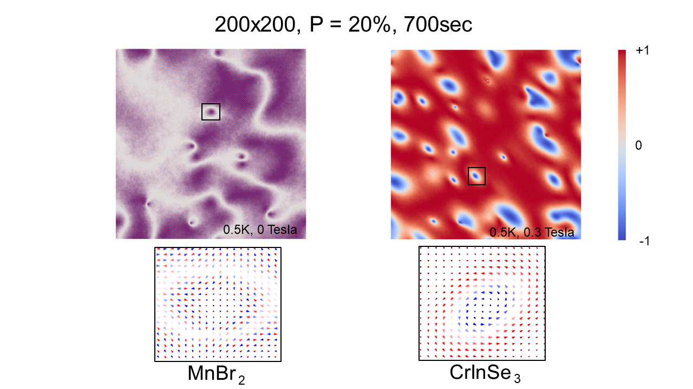

# Statement of need

Atomistic spin texture simulations are crucial for understanding and predicting the behaviour of magnetic materials at the nanoscale. These simulations provide insights into fundamental phenomena like magnetic phase transition and are thus useful for exploring novel materials [@kabiraj_realizing_2023]. The Metropolis [@metropolis_equation_1953] Monte-Carlo (MC) method is frequently utilised for atomistic spin texture simulations as a sampling algorithm to investigate the phase space of a system and is especially effective for calculating equilibrium properties.
Efficient parallelization of Metropolis Monte Carlo simulation is challenging since the evolving states are typically not independent because of the Markov property. Here we focus on simulating magnetic phase transition under the anisotropic Heisenberg Model [@heisenberg_zur_1928] in a very high dimensional space, which is important for emerging two-dimensional (2D) magnetism and nontrivial topological spin textures [@augustin_properties_2021]. Previous attempts for parallelization are restricted to the simpler Ising Model and not applicable to 2D materials because of their finite magneto crystalline anisotropy, complex crystal structures and long-range interactions. MC simulation of the anisotropic Heisenberg model is very complex owing to the large number of additional Hamiltonian calculations and interconnectivity between lattice points. The amount of calculations increases as $N^2$, where $N$ represents the dimension of a square lattice. This becomes alarming when $N$ exceeds 100, which is entirely justifiable for investigating topological spin textures (skyrmions, merons, etc). Existing open-source software for atomistic spin texture simulations such as [SPIRIT](https://spirit-code.github.io/) [@muller_spirit_2019] or [VAMPIRE](https://vampire.york.ac.uk/) [@evans_atomistic_2014] are based on the single spin update method. While this ensures detailed balance condition, it is very inefficient for finding ground state for ultra-large supercells.

Here we present CUDA-METRO, a graphical processing unit (GPU) based open-source code for accelerated atomistic spin dynamics simulation. This is based on an algorithm which simultaneously updates multiple spins irrespective of their mutual correlation and harnesses the extreme SIMD (Single Instruction Multiple Device) potential of the GPU  to access the ground state for ultra large supercells in a reasonable timescale. We evaluated our code by precisely simulating complex topological spin textures and temperature-dependent magnetic phase transitions for diverse 2D crystal structures with long-range magnetic interactions. We demonstrate exceptional acceleration while finding the ground state of a $750\times750$ supercell from an initial random spin configuration in 9 hours using an A100-SXM4 GPU.

# Summary

We consider a lattice system with a periodic arrangement of atoms, where each atom is represented by a 3D spin vector. This atomistic spin model is founded on the spin Hamiltonian, which delineates the essential spin-dependent interactions at the atomic scale, excluding the influences of potential and kinetic energy and electron correlations. The spin Hamiltonian of the $i^{th}$ atom is conventionally articulated as
$$
H_i=  -\sum_j J_1s_i\cdot s_j - \sum_j K^x_1 s^x_i s^x_j-\sum_j K^y_1 s^y_i s^y_j-\sum_j K^z_1 s^z_i s^z_j-\sum_k J_2 s_i\cdot s_k - \sum_k K^x_2 s^x_i s^x_k
$$
$$
-\sum_k K^y_2 s^y_i s^y_k -\sum_k K^z_2 s^z_i s^z_k -\sum_l J_3s_i\cdot s_l - \sum_l K^x_3 s^x_i s^x_l-\sum_l K^y_3 s^y_i s^y_l-\sum_l K^z_3 s^z_i s^z_l 
$$
$$
-\sum_m J_4s_i\cdot s_m - \sum_m K^x_4 s^x_i s^x_m-\sum_m K^y_4 s^y_i s^y_m -\sum_m K^z_4 s^z_i s^z_m - A s_i \cdot s_i-\sum_j \lambda(s_i\cdot s_j)^2  
$$
$$
-\sum_j D_{ij}\cdot (s_i \times s_j) -\mu B \cdot s_i
$$
Where $J$ is the isotropic exchange parameter, the $K$s are the anisotropic exchange parameters, with the superscript denoting the spin direction, $A$ is the single ion exchange parameter, $\lambda$ is the biquadratic parameter, $D$ is the Dyzaloshinskii-Moriya Interaction(DMI) parameter. $\mu$ is the dipole moment of a single atom and $B$ is the external magnetic field. $s_i,s_j$ are individual atomic spin vectors. $\{s_j\}$ are the first set of neighbours, $\{s_k\}$ are the second set of neighbours and so on. The subscripts below all $J$s and $K$s denote the neighbour set, $J_1$ denotes the first neighbours, $J_2$ the second and so on. In our code, we have limited the number of neighbour sets to be 4 since it is expected for 2D materials that the interaction energy dies down beyond that. All these above parameters except $B$ are material specific parameters that are the inputs to our MC code.

Starting from a random spin configuration, in this many-body problem, our objective is to find the orientation of spin vectors for every atom so that the energy of the entire lattice reaches to its minimum for a given magnetic field and temperature.
Traditionally single spin update(SSU) scheme is employed to solve this problem, which satisfies the detailed balance condition. In the SSU method of updating the state, a single atomic spin is chosen at random and changed, while noting down the energy shift. This new state is then accepted or rejected using the Metropolis criteria as shown in Algorithm 1, where $\beta=(k_bT)^{-1}$, $k_b$ being the Boltzmann constant and $T$ being the temperature. It is clear that SSU becomes extremely inefficient as the dimensionality increases.
\begin{algorithm}
    \caption{Metropolis Selection}
    \label{algorithm:MS1}
    \begin{algorithmic}[1]
        \Procedure{M}{$H_f,H_i$}
            \If {$\Delta H < 0$}
            \State \texttt{Return 1 (ACCEPT)}
            \ElsIf {$e^{\beta \Delta H} < R$}\Comment{$R$ is uniformly random}
            \State \texttt{Return 1 (ACCEPT)}
            \Else
            \State \texttt{Return 0 (REJECT)}
            \EndIf
        \EndProcedure
    \end{algorithmic}
\end{algorithm}
In our method, as depicted in Algorithm 2, we select multiple atomic spins at the same time and change them all at once, treating them as independent events. For any individual spin, they do not feel the effects of the other changed spins. In each of these points, we use the Metropolis criteria to accept or reject the changed spin vectors. This becomes our new state. Here $P$ denotes the number of lattice points we are evaluating at the same time for any given state, while $\Gamma$ is the batch size. Tuning $\Gamma$ ensures that we can fill up our VRAM with pre-generated random numbers instead of generating $4\times P$ numbers per step. These 4 random number arrays are further processed into $n$, our site selection, $(\theta,\phi)$, which become the angle coordinates for a new random spin vector and $r$ which is a conditional uniform random number used to evaluate the Metropolis criteria.
\begin{algorithm}
    \caption{Parallel Monte Carlo}
    \label{algorithm:MS2}
    \begin{algorithmic}[1]
        \Procedure{Step}{Run}
            \State Read Initial state
            \State Create 4 $P\times \Gamma$ length uniform random arrays
            \State Process the 4 uniform random number arrays
            \For{$i<\Gamma$}
              \State Slice the 4 arrays into sub-arrays with range $[P\times i:P\times (i+1)-1]$
              \State Execute P parallel BLOCKS with these sub arrays
              \For{In each BLOCK}
                \State Evaluate $H$ before$(T0)$ and after$(T1)$ spin change \Comment{Multithreading}
                \State Wait for all BLOCKS to finish then increment $i$
              \EndFor
            \State Update all $P$ spins to next state
            \State This state is now our next state
            \EndFor
        \EndProcedure
    \end{algorithmic}
\end{algorithm}
At present, five different lattice types  (square, rectangular, centred-rectangular, hexagonal and honeycomb) are implemented in our code since most of the 2D magnetic materials fall into this category [@kabiraj_massive_2022], and for neighbour mapping, we use analytical relations [@Koziol2020-cp].

For a lattice of size $N\times N$, $100\%$ parallelization would correspond to selecting $N^2$ spins at random. Since each spin selection and its consequent Metropolis criterion is evaluated on a separate CUDA core, it becomes apparent that we would need $N^2$ CUDA cores to achieve this $100\%$ parallelization.Since the proposed algorithm may not adhere to the detailed balance conditions, it yields approximate results, and there is a trade-off between parallelization/acceleration and accuracy. It is found that if the parallelization is limited to $10\%$ of the lattice size, we obtain very accurate results with significant acceleration.

Unlike the SSU scheme, we do not extract simulation data after every $N^2$ spin change, rather we let it run till all the CUDA cores have sychronized and arrived at the next block check, which defines our step. To directly compare, if the SSU has $1$ spins changed between each step, our algorithm will have $P$, where $P$ is the number of CUDA cores used or parallelization used. In the conventional SSU, data is extracted at every $N^2$(a full sweep) steps, compared to which, we would take $\frac{N^2}{P}$ steps to reach the same data point.

We validate our algorithm by accurately reproducing temperature-dependent magnetic phase transitions and intricate topological spin textures already reported in the literature, either by SSU based Monte Carlo or by Landau Lifshitz Gilbert(LLG) [@gilbert_classics_2004] spin dynamics, for diverse crystal structures.

It was once thought that long-range magnetic order could not exist [@PhysRevLett.17.1133] in two or one-dimensional materials. In 2017, $\text{CrI}_\text{3}$ was one of the first 2D materials [@Huang2017] where ferromagnetism was demonstrated. Using CUDA-METRO, we first simulate the magnetic phase transition of $\text{CrI}_\text{3}$ from ferromagnetic to paramagnetic with increasing temperature. In Fig 1, we reproduce magnetic phase transition from [@Kartsev2020], and show the effect of parallelization with respect to the reference data. As mentioned before, we can obtain very accurate results with respect to SSU methods by limiting the parallelization at $10\%$ or below of $N^2$. The ferromagnetic to paramagnetic transition point is known as Critical temperature and is extracted from the peak of the susceptibility versus temperature plot.

Next, we demonstrate the nucleation of topological spin textures which are emergent phenomena in condensed matter physics and are rapidly having importance in information technology [@luo_skyrmion_2021;@bessarab_lifetime_2018]. While MC simulations of medium-sized supercells $(64 \times 64)$ yield quite accurate results for Critical temperature calculation, observing topological spin textures, once needs much larger supercells.

# Results

In these examples, we always initialize the lattice with random spin configurations. First, we simulate skyrmions in $\text{MnBr}_\text{2}$ [@acs_nanolett] as shown in Fig 2. $\text{MnBr}_\text{2}$ is a square lattice and for this simulation, we have considered up to the second nearest neighbour. This material exhibits anisotropic DMI with an anti-ferromagnetic ground state. An anti-ferromagnetic skyrmion spin texture is accurately reproduced in our simulation. Anti-ferromagnetic skyrmions are technologically important since they do not exhibit skyrmion Hall effect. We further study the material $\text{CrInSe}_\text{3}$ [@du_spontaneous_2022] which has a hexagonal lattice. This simulation was conducted considering only the nearest neighbours and the formation of skyrmions is shown in Fig 2. Once again our results are in agreement with the original report. All these simulations were conducted in a $200 \times 200(49 \times 49nm^2)$ supercell and took 30s to stabilize these topological spin textures at a parallelization of $20\%$ conducted on a V100-SXM2 processor.

In Fig 3 we demonstrate the skyrmion neucleation process for the material $\text{MnSTe}$ [@liang_very_2020], which has a hexagonal lattice. While we first observe several skyrmions, with evolving MCS, they disappear and the whole lattice eventually becomes uniformly ferromagnetic,which happens to be the direction of the applied magnetic field. This has not been reported in the original literature[@liang_very_2020], possibly because of the high computational time required for a traditional SSU scheme.

In the main page [here](https://github.com/arkavo/CUDA-METRO/blob/main/figures/Figure_5.PNG) we further show a similar life cycle evolution for a giant skyrmion of diameter 21nm hosted in the material VZr3C3II [@kabiraj_realizing_2023]. To host such a large skyrmion, the simulation was conducted in a supercell of size $750\times750$ and the ground state was achieved in  9 hours using an A100-SXM4 GPU.

Fig 1: Discrepancy between simulation and reference [@Kartsev2020] results at differing levels of parallelization. At $10\%$, the simulation results are almost indistinguishable from the reference data.

Fig 2: Presence of skyrmions in $\text{MnBr}_\text{2}$ and $\text{CrInSe}_\text{3}$. The material parameters are taken from [@acs_nanolett] and [@du_spontaneous_2022] respectively. The color bar represents normalized spin vectors in the z direction. Note that the spins of $\text{MnBr}_\text{2}$ appear purple because there are "red-blue" spin pairs for the vast majority.

Fig 3: Lifetime of a skyrmion in $\text{MnSTe}$, from its creation to annihilation. The graph denotes the average energy per atom. As we approach the global minima, the entire field becomes aligned to the magnetic field as expected. Total time: $30s$.

# Acknowledgements
This work is supported by the Core Research Grant (CRG) scheme of the Science and Engineering Research
Board (SERB), Government of India, under Grant No. CRG/2020/000758.

# References
