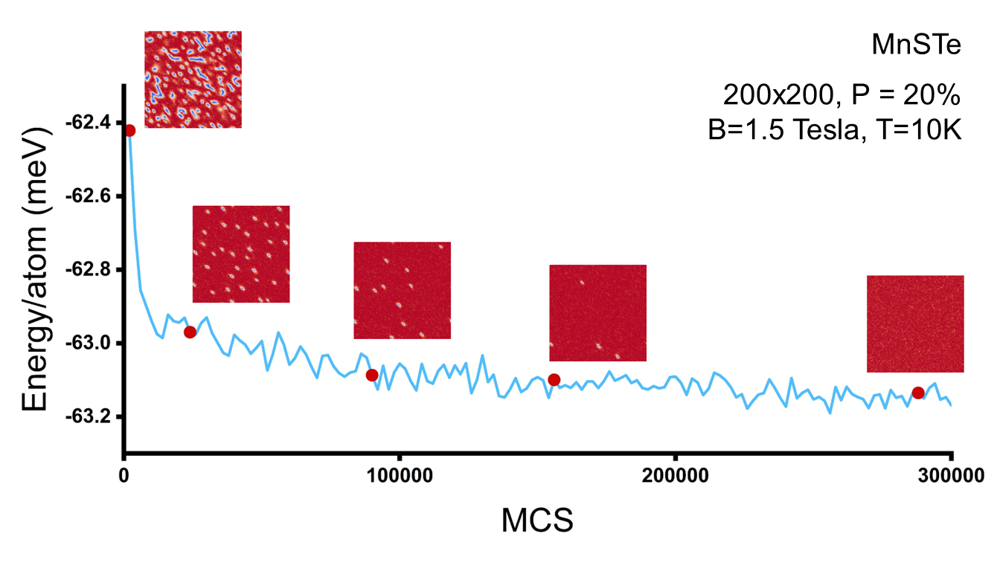

\begin{algorithm}[t]
    \caption{Parallel Monte Carlo}
    \label{algorithm:step}
    \begin{algorithmic}[0]
        \Procedure{Step}
        \hspace*{4.5em}
        \State \hspace*{4.5em}{Read State $\Omega_i$}
        \State \hspace*{4.5em}{Create 4 $P\times B$ length uniform random arrays}
        \State \hspace*{4.5em}{Process 4 arrays into $N,\theta, \phi, R$}
        \For{\hspace*{4.5em}{$i<B$}}
            \State \hspace*{4.5em}{Create 4 sub-arrays as $(N,\theta,\phi,R)[P\times i:P\times (i+1)-1]$}
            \State \hspace*{4.5em}{Execute $P$ parallel BLOCKS with sub array $(N,\theta,\phi,R)[j]$}\Comment{$j\in [P\times i,P\times (i+1)]$}
            \For{In each BLOCK}
                \State \hspace*{4.5em}{Evaluate $H$ before(T0) and after(T1) spin change}\Comment{Multithreading}
                \State \hspace*{4.5em}{Select spins according to $S_{new} = S_f(M(H_f,H_i)) + S_i(1-M(H_f,H_i))$}
                \State \hspace*{4.5em}{Wait for all BLOCKS to finish}
            \EndFor
            \State \hspace*{4.5em}{Update all $P$ spins to state}
            \State \hspace*{4.5em}{$\Omega_{i+1} \leftarrow \Omega_{i}$}
        \EndFor
        \EndProcedure
    \end{algorithmic}
\end{algorithm}[t]

header-includes: |
  - \usepackage{algorithm}
  - \usepackage[noend]{algpseudocode}
  - \usepackage{chemformula}

---
title: 'CUDA-METRO: Parallel Metropolis Monte-Carlo for 2D Atomistic Spin Texture Simulation'
tags:
  -  Python
  -  Monte Carlo
  -  CUDA
  -  spintronics
  -  2D
authors:
  - name: Arkavo Hait
    orcid: 0009-0006-6741-9377
    equal-contrib: true
    affiliation: 1
  - name: Santanu Mahapatra
    orcid: 0000-0003-1112-8109
    equal-contrib: true
    affiliation: 1
affiliations:
  - name: Indian Institute of Science
    index: 1
    ror: [04dese585](https://ror.org/04dese585)
header-includes:
  - \usepackage{algorithm}
  - \usepackage[noend]{algpseudocode}
  - \usepackage{chemformula}
output:
  pdf_document
date: 30 Sept 2024
bibliography: references.bib

---

\begin{algorithm}
    \caption{Parallel Monte Carlo}
    \label{algorithm:step}
    \begin{algorithmic}[0]
        \Procedure{Step}
        \State \texttt{Read State $\Omega_i$}
        \State \texttt{Create 4 $P\times B$ length uniform random arrays}
        \State \texttt{Process 4 arrays into $N,\theta, \phi, R$}
        \For{\texttt{$i<B$}}
            \State \texttt{Create 4 sub-arrays as $(N,\theta,\phi,R)[P\times i:P\times (i+1)-1]$}
            \State \texttt{Execute $P$ parallel BLOCKS with sub array $(N,\theta,\phi,R)[j]$}\Comment{$j\in [P\times i,P\times (i+1)]$}
            \For{In each BLOCK}
                \State \texttt{Evaluate $H$ before(T0) and after(T1) spin change}\Comment{Multithreading}
                \State \texttt{Select spins according to $S_{new} = S_f(M(H_f,H_i)) + S_i(1-M(H_f,H_i))$}
                \State \texttt{Wait for all BLOCKS to finish}
            \EndFor
            \State \texttt{Update all $P$ spins to state}
            \State \texttt{$\Omega_{i+1} \leftarrow \Omega_{i}$}
        \EndFor
        \EndProcedure
    \end{algorithmic}
\end{algorithm}

\begin{algorithm}[t]
    \caption{Metropolis Selection}
    \label{algorithm:MS}
    \begin{algorithmic}[0]
        \Procedure{M}{$H_f,H_i$}
            \If {$\Delta H < 0$}
            \State \texttt{Return 1 (ACCEPT)}
            \ElsIf {$e^{\beta \Delta H} < R$}\Comment{$R$ is uniformly random}
            \State \texttt{Return 1 (ACCEPT)}
            \Else
            \State \texttt{Return 0 (REJECT)}
            \EndIf
        \EndProcedure
    \end{algorithmic}
\end{algorithm}

$$
H_i=  -\sum_j J_1s_i\cdot s_j - \sum_j K^x_1 s^x_i s^x_j-\sum_j K^y_1 s^j_i s^j_j-\sum_j K^z_1 s^z_i s^z_j -\sum_k J_2 s_i\cdot s_k - \sum_k K^x_2 s^x_i s^x_k-\sum_k K^y_2 s^j_i s^j_k-\sum_k K^z_2 s^z_i s^z_k-\sum_l J_3s_i\cdot s_l - \sum_l K^x_3 s^x_i s^x_l-\sum_l K^y_3 s^j_i s^j_l-\sum_l K^z_3 s^z_i s^z_l -\sum_m J_4s_i\cdot s_m - \sum_m K^x_4 s^x_i s^x_m-\sum_m K^y_4 s^y_i s^y_m -\sum_m K^z_4 s^z_i s^z_m- A s_i \cdot s_i-\sum_j \lambda(s_i\cdot s_j)^2  -\sum_j D_{ij}\cdot (s_i \times s_j) -\mu B \cdot s_i
$$

# Statement of need

Atomistic spin texture simulations are crucial for understanding and predicting the behaviour of magnetic materials at the nanoscale. These simulations provide insights into fundamental properties like magnetic phase transition and are thus useful for exploring novel materials [@kabiraj_realizing_2023]. The Metropolis[@metropolis_equation_1953] Monte-Carlo[@heisenberg_zur_1928] (MC) method is frequently utilised for atomistic spin texture simulations as a sampling algorithm to investigate the phase space of a system and is especially effective for calculating equilibrium properties [@evans_atomistic_2014;@PhysRevB.99.224414].
Efficient parallelization of Metropolis Monte Carlo simulation is challenging since the evolving states are typically not independent because of the Markov property. Here we focus on simulating magnetic phase transition under the anisotropic Heisenberg Model in a very high dimensional space, which is important for emerging two-dimensional (2D) magnetism and nontrivial topological spin textures [@augustin_properties_2021]. Previous attempts for parallelization are restricted to the simpler Ising Model and not applicable to 2D materials because of their finite magneto crystalline anisotropy, complex crystal structures and long-range interactions. MC simulation of the anisotropic Heisenberg model is very complex owing to the large number of additional Hamiltonian calculations and interconnectivity between lattice points. The amount of calculations increases as $N^2$, where $N$ represents the dimension of a square lattice. This becomes alarming when $N$ exceeds 100, which is entirely justifiable for investigating topological spin textures (skyrmions, merons, etc.)
Here we present CUDA-METRO, a graphical processing unit (GPU) based open source code for accelerated atomistic spin dynamics simulation. We evaluated our code by precisely simulating complex topological spin textures and temperature-dependent magnetic phase transitions for diverse 2D crystal structures with long-range magnetic interactions. We demonstrate exceptional acceleration while finding the ground state of a $750\times750$ supercell in 9 hours using an A100-SXM4 GPU.

Algo1

Here $\beta=(k_bT)^{-1}$, $k_b$ being the Boltzmann constant and $T$ being the temperature.

In our method, as depicted in [@algorithm:step], we select multiple atomic spins at the same time and change them all at once, treating them as independent events. For any individual spin, they do not feel the effects of the other changed spins. In each of these points, we use the Metropolis criteria to accept or reject the changed spin vectors. This becomes our new state.

Algo2

At present, five different lattice types  (square, rectangular, centred-rectangular, hexagonal and honeycomb) are implemented in our code since most of the 2D magnetic materials fall into this category [@kabiraj_massive_2022], and for neighbour mapping, we use analytical relations [@Koziol2020-cp].

For a lattice of size $N\times N$, $100\%$ parallelization would correspond to selecting $N^2$ spins at random. Since each spin selection and its consequent Metropolis criterion is evaluated on a separate CUDA core, it becomes apparent that we would need $N^2$ CUDA cores to achieve this $100\%$ parallelization.Since the proposed algorithm may not adhere to the detailed balance conditions, it yields approximate results, and there is a trade-off between parallelization/acceleration and accuracy. It is found that if the parallelization is limited to $10\%$ of the lattice size, we obtain very accurate results with significant acceleration.

We define our Monte Carlo Step(MCS) to be a collection of many atomic steps. The exact number depends on the parallelization used in the simulation. Unlike the SSU scheme, we do not extract simulation data after every spin change, rather we let it run till all the CUDA cores have sychronized and arrived at the next block check, which forms our step. To directly compare, if the SSU has $1$ spins changed between each step, our algorithm will have $P$, where $P$ is the number of CUDA cores used or parallelization used. In the conventional SSU, data is extracted at every $N^2$(a full sweep) steps, compared to which, we would take 
$$S=\frac{N^2}{P}$$
steps to reach the same data point.

We validate our postulate by accurately reproducing temperature-dependent magnetic phase transitions and intricate topological spin textures already reported in the literature, either by single spin update based Monte Carlo or by Landau Lifshitz Gilbert(LLG)[@gilbert_classics_2004] spin dynamics, for diverse crystal structures.

It was once thought that long-range magnetic order could not exist [@PhysRevLett.17.1133] in two or one-dimensional materials. In 2005, $CrI_3$ was one of the first 2D materials [@Huang2017] where ferromagnetism was demonstrated. Consequently, further studies have shown the existence of long-range magnetic order in several other 2D materials. Using CUDA-METRO, we first simulate the magnetic phase transition of $CrI_3$ from ferromagnetic to paramagnetic with increasing temperature. The rise of temperature causes the atomic spins not to be locked into a ferromagnetic position but rather gives them enough energy to orient themselves in any direction. The average direction of all the spins would then lead to a null vector, which gives rise to paramagnetism. In Fig 1, we reproduce magnetic phase transition from [@augustin_npj], and show the effect of parallelization with respect to the reference data. As mentioned before, we can obtain very accurate results with respect to SSU methods by limiting the parallelization at $10\%$ or below of $N^2$. The ferromagnetic to paramagnetic transition point is known as Critical temperature and is extracted from the peak of the susceptibility versus temperature plot.

Next, we demonstrate the nucleation of topological spin textures which are emergent phenomena in condensed matter physics which are rapidly having importance in information technology[@psaroudaki_skyrmion_2021;@luo_skyrmion_2021;@bessarab_lifetime_2018]. While MC simulations of medium-sized supercells $(64 \times 64)$ yield quite accurate results for Critical temperature calculation, observing topological spin textures, once needs much larger supercells.

First, we report the "meron" and "anti-meron", which are structures with topological numbers $-1/2$ and $+1/2$ respectively observed in {CrCl3} by Landau Lifshitz Gilbert(LLG)equations of spin dynamics. The results of our simulation are shown in Fig 2. {CrCl3} has a honeycomb lattice structure and for this simulation, we have considered up to the third nearest neighbour with biquadratic exchange. We can see all 4 types of meron and anti-meron structures as found in the previous report[@augustin_properties_2021]. This simulation was conducted in a $500 \times 500(143 \times 143 nm^2)$ supercell and took 300s to stabilize these topological spin textures at a parallelization of $3\%$ conducted on an A100-SXM4 processor.

Second we simulate skyrmions in {MnBr2}[@doi:10.1021/acs.nanolett.1c04803] as shown in Fig 3; {MnBr2} is a square lattice and for this simulation, we have considered up to the second nearest neighbour. The uniqueness of this material is that it exhibits anisotropic DMI with an anti-ferromagnetic ground state. Such an anti-ferromagnetic skyrmion spin texture is accurately reproduced in our simulation. Anti-ferromagnetic skyrmions are technologically important since they do not exhibit skyrmion Hall effect. We further study the material {CrInSe3} [@du_spontaneous_2022] which has a hexagonal lattice. This simulation was conducted considering only the nearest neighbours and the formation of skyrmions is shown in Fig 3. Once again our results are in agreement with the original report. All these simulations were conducted in a $200 \times 200(49 \times 49nm^2)$ supercell and took 30s to stabilize these topological spin textures at a parallelization of $20\%$ conducted on a V100-SXM2 processor.

In Fig 4 we demonstrate the skyrmion neucleation process for the material {MnSTe} [@kulish_single-layer_2017], which has a hexagonal lattice. While we first observe observe several skyrmions, with evolving MCS, they disappear and the whole lattice eventually becomes uniformly ferromagnetic,which happens to be the direction of the applied magnetic field. This has not been reported in the original literature[@liang_very_2020], possibly because of the high computational time required for a traditional single spin update algorithm. In Fig 5, we further show a similar life cycle evolution for a giant skyrmion of diameter $21nm$ hosted in the material {VZr3C3II} [@kabiraj_realizing_2023]. To host such a large skyrmion, the simulation was conducted in a supercell of size $750\times 750$ with a parallelization ratio of $1\%$ utilizing $70\%$ VRAM of an A100-SXM4 GPU. As mentioned before, our parallelization is limited by the number of CUDA cores and so we cannot go more than $1\%$ parallelization for this simulation. However, even with this low parallelization ratio, we can still access 8000 lattice points simultaneously and by careful tuning of our parameter $B$, we can observe the ground state of a $750\times750$ supercell in $9$ hours using an A100-SXM4 GPU. The formation of the skyrmion roughly takes $100$ mins.

Fig 1: Discrepancy between simulation and reference[@Kartsev2020] results at differing levels of parallelization. At $10\%$, the simulation results are almost indistinguishable from the reference data.

Fig 2: Presence of Skyrmions and Merons in {CrCl3}. The material parameters are taken from [@augustin_properties_2021]. The color bar represents normalized spin vectors in the z direction.

Fig 3: Presence of anti-skyrmions in {MnBr2} and skyrmions in {CrInSe3}. The color bar represents normalized spin vectors in the z direction. Note that the spins of {MnBr2} appear purple because there are "red-blue" spin pairs for the vast majority.

Fig 4: Lifetime of a skyrmion in {MnSTe}, from its creation to annihilation. The graph denotes the average energy per atom. As we approach the global minima, the entire field becomes aligned to the magnetic field as expected. Total time: $30s$.

Fig 5: Lifetime of a skyrmion in {VZr3C3II}, from its creation to annihilation. The graph denotes the average energy per atom. Note how the entire field is now blue (as opposed to red as in Fig 4), this is because unlike the simulation in Fig 4, there is no external magnetic field applied, this means that the ground state would either be all spins up(red) or all spins down(blue) with a $50\%$ probability for either. Total time: $9$ hrs.

# Acknowledgements
This work is supported by the Core Research Grant (CRG) scheme of the Science and Engineering Research
Board (SERB), Government of India, under Grant No. CRG/2020/000758.

# References

\Procedure{Step}
        \State \texttt{Read State $\Omega_i$}
        \State \texttt{Create 4 $P\times B$ length uniform random arrays}
        \State \texttt{Process 4 arrays into $N,\theta, \phi, R$}
        \For{$i<B$}
            \State  \texttt{Create 4 sub-arrays as $(N,\theta,\phi,R)[P\times i:P\times (i+1)-1]$}
            \State  \texttt{Execute $P$ parallel BLOCKS with sub array $(N,\theta,\phi,R)[j]$}\Comment{$j\in [P\times i,P \times (i+1)]$}
            \For{In each BLOCK}
                \State \texttt{Evaluate $H$ before(T0) and after(T1) spin change}\Comment{Multithreading}
                \State \texttt{Select spins according to $S_{new} = S_f(M(H_f,H_i)) + S_i(1-M(H_f,H_i))$}
                \State \texttt{Wait for all BLOCKS to finish}
            \EndFor
            \State  \texttt{Update all $P$ spins to state}
            \State  \texttt{$\Omega_{i+1} \leftarrow \Omega_{i}$}
        \EndFor
        \EndProcedure

\begin{algorithm}
    \caption{Parallel Monte Carlo}
    \label{algorithm:step}
    \begin{algorithmic}[0]
        \Procedure{Step}
        \EndProcedure
    \end{algorithmic}
\end{algorithm}

 - \usepackage[utf8]{inputenc}
 - \usepackage{lmodern}

 Retry